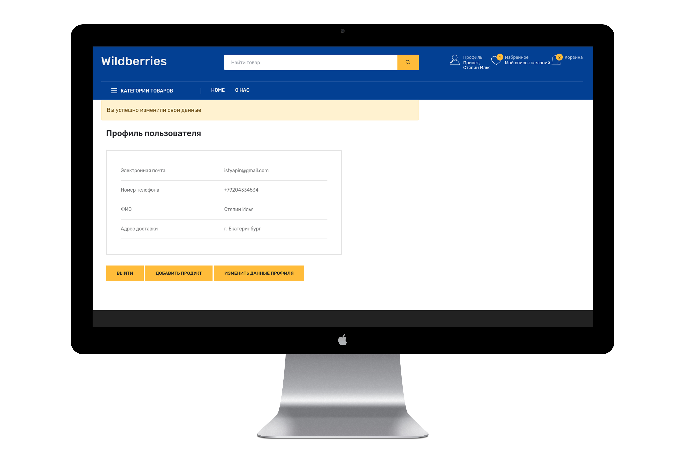
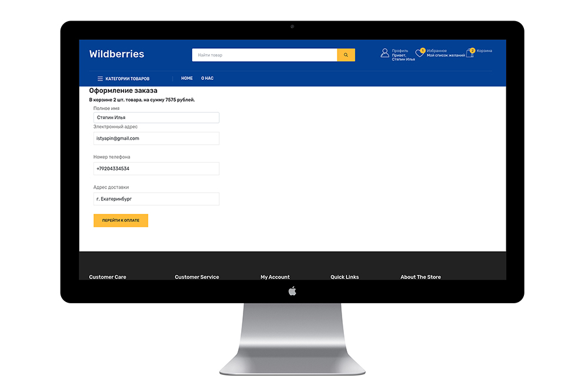

# Интернет магазин на Flask

Marketplace - это web-приложение интернет магазина написанного на Flask.


## В этом проекте реализовано:

- "Живой" поиск товаров через поисковую строку
- Добавление/удаление товаров в корзину
- Добавление товаров в избранное
- Процесс оформления и оплаты заказа
- Обработка статусов оплаты
- Отправка sms/email уведомлении через celery

## Сборка репозитория

1. Склонируйте репозиторий с GitHub - `git clone https://github.com/MihailR1/Marketplace.git`
2. Создайте и активируйте виртуальное окружение
3. Установите зависимости - `pip install -r requirements.txt`
4. Добавьте файл `.env` в корневую директорию

## Конфигурация .env файла

> Настройка БД:

```
DATABASE_URL='адрес до БД'  
SECRET_KEY='секретный ключ для FLASK'
```

> Настройка отправки email через Unisender:

```
UNISENDER_API_KEY = ''  
ADMIN_EMAIL = ''  
ADMIN_PASSWORD = ''  
```

> Настройка отправки смс через MainSMS:

```
MAINSMS_PROJECT_NAME = ''  
MAINSMS_API_KEY = ''  
```

> Настройка оплаты YooMoney:

```
YOOMONEY_CLIENT_ID = ''  
YOOMONEY_REDIRECT_URI = ''  
YOOMONEY_AUTH_URL = ''  
YOOMONEY_WALLET = ''  
YOOMONEY_TOKEN = ''  
YOOMONEY_SECRET_KEY = '' 
```

## Подготовка к первому запуску проекта

1. Запустите скрипт создания БД - `python create_db.py`
2. Запустите скрипт наполнения БД категориями - `python save_categories.py`
3. Запустите скрипт наполнения БД товарами - `python save_products.py`

## Запуск

Чтобы запустить web-приложение, выполните в консоли:

- Windows `run.bat`
- Linux `run.sh`

## Больше скриншотов сайта




