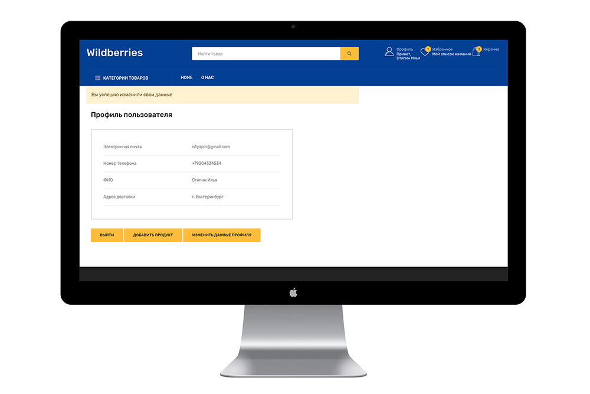

# Интернет магазин на Flask

Marketplace - это flask-приложение классического интернет магазина. Больше скриншотов сайта в конце этой статьи.


## В этом проекте реализовано:

- Авторизация/регистрация через логин-пароль и по sms коду подтверждения
- "Живой" поиск товаров через поисковую строку
- Сортировка товаров по цене
- Представление дерева категории товаров из БД и подключено кеширование меню
- Страница профиля пользователя, где юзер может изменить данные
- Возможность добавление товаров пользователем через страницу профиля
- Добавление/удаление товаров в корзину
- Добавление товаров в избранное
- Процесс оформления заказа
- Настроен процесс оплаты заказа с проверками статусов платежей
- Интегрированны сервисы отправки sms/email уведомлении о событиях через celery

## Сборка репозитория

1. Склонируйте репозиторий с GitHub - `git clone https://github.com/MihailR1/Marketplace.git`
2. Создайте и активируйте виртуальное окружение
3. Установите зависимости - `pip install -r requirements.txt`
4. Добавьте файл `.env` в корневую директорию

## Конфигурация .env файла

> Настройка БД:

```
DATABASE_URL='адрес до БД'  
SECRET_KEY='секретный ключ для FLASK'
```

> Указать почту и пароль для регистрации админа (нужен для добавления товаров в БД из файла):

```
ADMIN_EMAIL = ''  
ADMIN_PASSWORD = ''  
```

> Настройка отправки email через Unisender:

```
UNISENDER_API_KEY = ''  
```

> Настройка отправки смс через MainSMS:

```
MAINSMS_PROJECT_NAME = ''  
MAINSMS_API_KEY = ''  
```

> Настройка оплаты YooMoney:

```
YOOMONEY_CLIENT_ID = ''  
YOOMONEY_REDIRECT_URI = ''  
YOOMONEY_AUTH_URL = ''  
YOOMONEY_WALLET = ''  
YOOMONEY_TOKEN = ''  
YOOMONEY_SECRET_KEY = '' 
```

## Подготовка к первому запуску проекта

1. Запустите скрипт создания БД - `python create_db.py`
2. Запустите скрипт наполнения БД категориями - `python save_categories.py`
3. Запустите скрипт наполнения БД товарами - `python save_products.py`

## Запуск

Чтобы запустить web-приложение, запустите файл:

- Windows `run.bat`
- Linux `run.sh`

## Над проектом работали:

- Михаил Р., Python-разработчик - [MihailR1](https://github.com/MihailR1)
- Илья Стяпин, Python-разработчик - [Straigan](https://github.com/Straigan)
- Тимур Одинцов, Team Lead/куратор - [OdintsovTim](https://github.com/OdintsovTim)

## Больше скриншотов сайта




